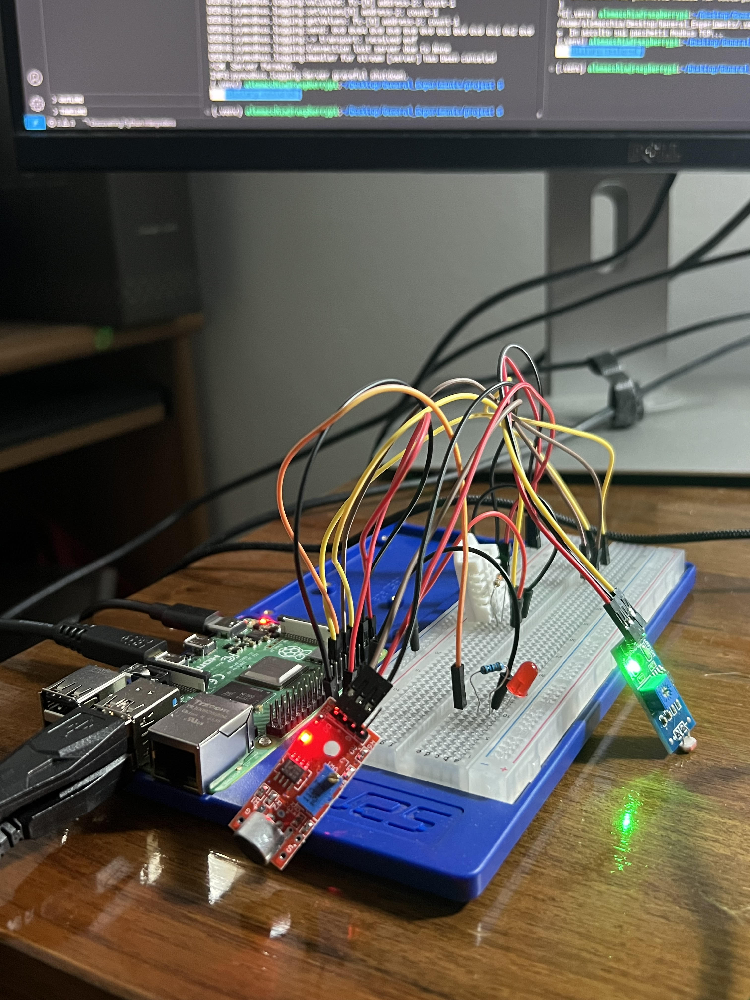
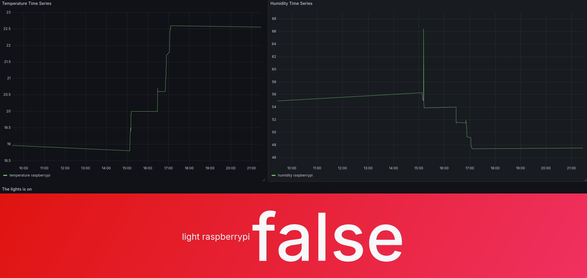

# Raspberry Pi Sensors Project

This project uses a Raspberry Pi to collect environmental data from temperature, humidity, and light sensors. The collected data is stored in InfluxDB and visualized in real-time on Grafana, allowing easy and efficient monitoring of environmental conditions.

## How It Works

1. **Data Collection:**
   - The Raspberry Pi is connected to temperature, humidity, and light sensors.
   - It continuously collects environmental data from these sensors.

2. **Data Storage with InfluxDB:**
   - The collected data is stored in **InfluxDB**, a powerful time-series database designed for high-performance data logging and retrieval.
   - InfluxDB is optimized for handling time-stamped data, making it perfect for recording sensor readings over time.

3. **Data Visualization with Grafana:**
   - The data is visualized in **Grafana**, an open-source analytics and interactive visualization platform.
   - We display time series graphs for **temperature** and **humidity**, showing their trends over time.
   - The latest state of the **light sensor** is shown as a simple indicator, where it reveals whether the light is currently **on** or **off**.

## Future Updates

- The code will be improved to become more **automated** and **self-managing**, reducing manual configuration and enhancing overall reliability.
- Additional sensors and metrics may be integrated, expanding the scope of environmental monitoring.
- Improved alerting and notification features in Grafana will be added for real-time environmental condition updates.

Stay tuned for more improvements and updates!

